# 뚜밤뚜밤

<div align="center">


[](https://hits.seeyoufarm.com)

</div>

# 뚜밤뚜밤

> **2024 열린데이터광장 공공데이터 활용 창업 경진대회 우수상 (220팀 중 3위)** <br/> **개발기간: 2024.04 ~ 2024.06**

## 배포 주소

> **개발 버전** : [https://ddubam.site/](https://ddubam.site/)

## 팀 소개

|                                  최승빈                                   |                                   노우영                                   |                                   김수영                                   |                                    이재준                                     |                                    권지민                                     |
| :-----------------------------------------------------------------------: | :------------------------------------------------------------------------: | :------------------------------------------------------------------------: | :---------------------------------------------------------------------------: | :---------------------------------------------------------------------------: |
|  |  |  |  |  |
|                  [@csb9427](https://github.com/csb9427)                   |                  [@norunaru](https://github.com/norunaru)                  |                  [@sootudio](https://github.com/sootudio)                  |                [@jaejunlee11](https://github.com/jaejunlee11)                 |                                                                               |
|                              Team Leader, PM                              |                                  Frontend                                  |                                  Backend                                   |                                    Backend                                    |                                    Design                                     |

## 프로젝트 소개

뚜밤뚜밤은 서울시 관광지와 CCTV 공공데이터를 활용하여 안전하게 이동하고 서울을 둘러보는 서비스입니다.

### 배경

- 사회적 필요성: 2022년 사회조사 결과에 따르면, 13세 이상 인구 3명 중 1명은 야간 보행 시 불안함을 느끼고 있습니다.
- 불안감 통계: 한국보건사회연구원의 조사에 따르면, 한국은 범죄 피해경험률은 가장 낮지만, 범죄에 대한 불안감은 최상위권에 속합니다.

### 서비스 목적

서울시 관광지와 CCTV 공공데이터를 활용해:

- 안전한 이동 경로를 제공
- 주위 환경을 실시간으로 모니터링하여 안전성을 높임

이 서비스를 통해 서울 시민과 관광객들이 보다 안심하고 야간에도 자유롭게 이동할 수 있는 환경을 조성하고자 합니다.

## Stacks 🐈

### Environment


### Config


### Development


### Communication


## 디자인 시스템


## 화면 구성 📺

### 온보딩 페이지

<p align="center">
  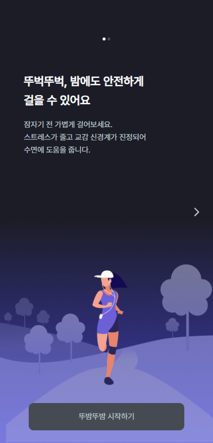
  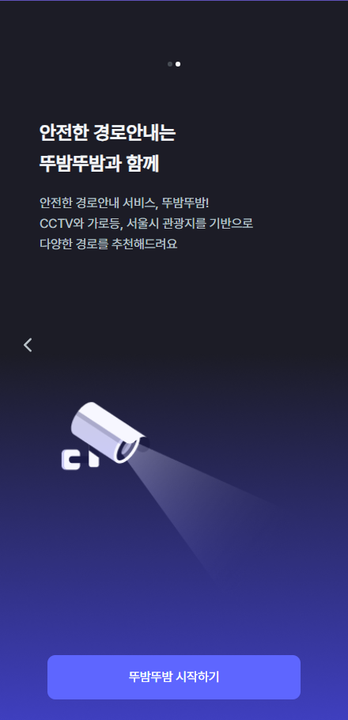
</p>

### 홈 페이지

<p align="center">
  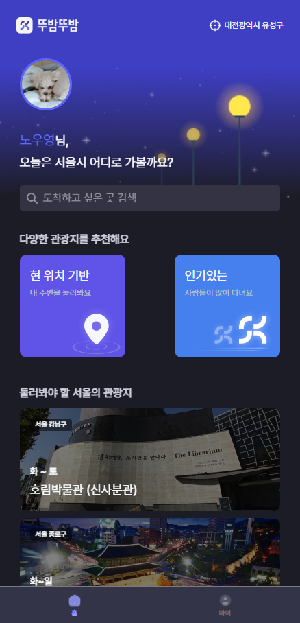
  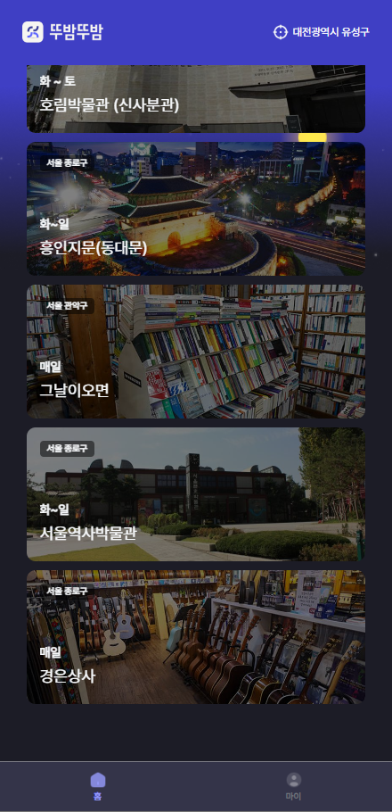
</p>

### 검색 페이지

<p align="center">
  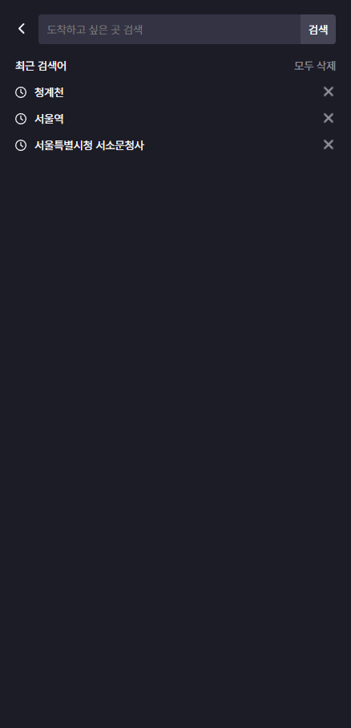
  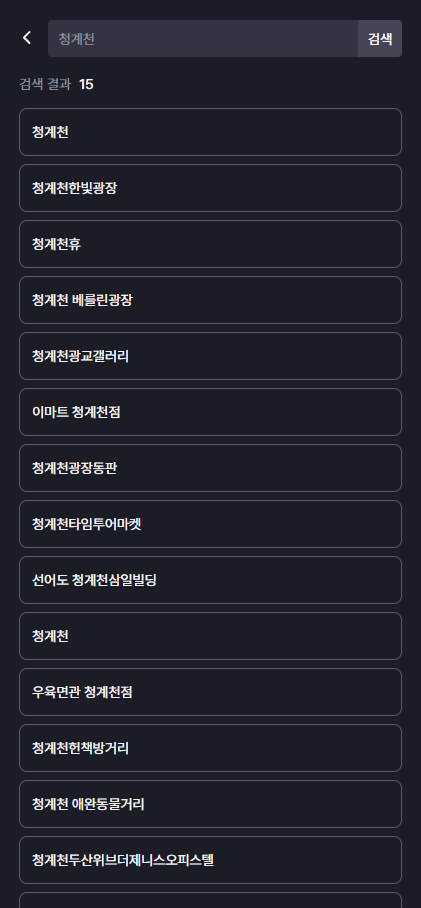
</p>

### 길안내 페이지

<p align="center">
  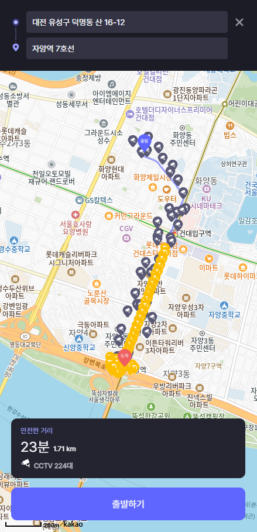
  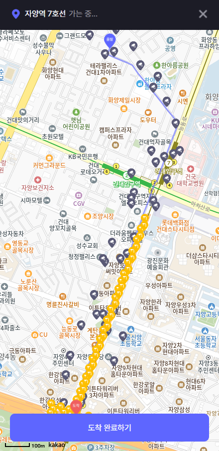
  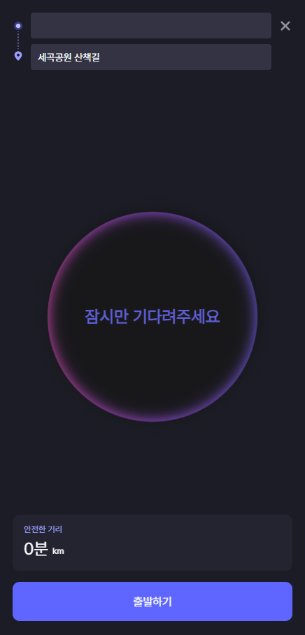
</p>

### 산책로 정보 페이지, 코스 정보 페이지

<p align="center">
  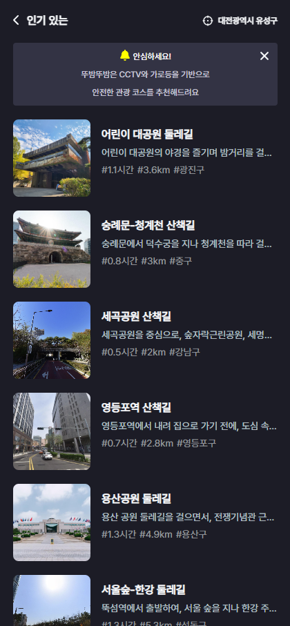
  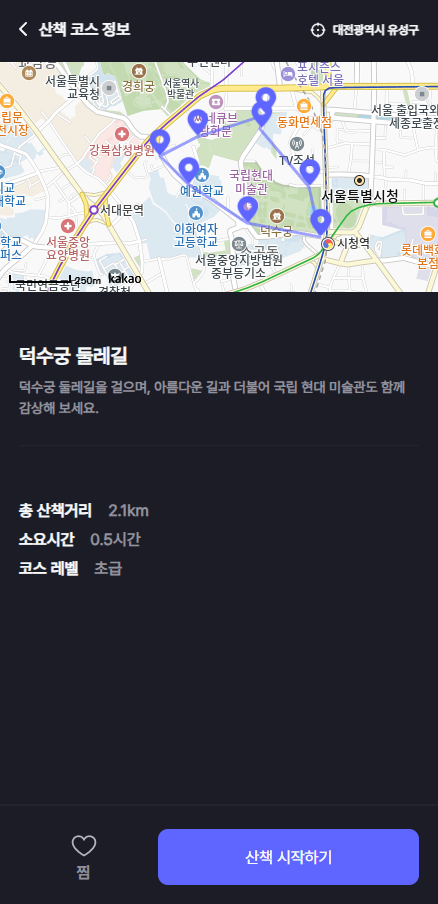
</p>

### 마이페이지, 모바일 페이지

<p align="center">
  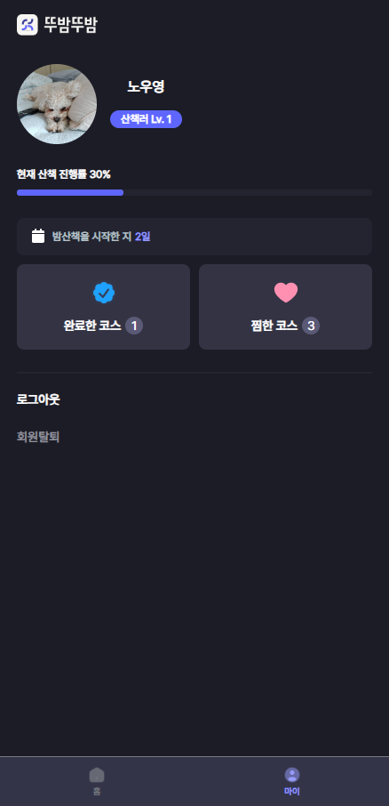
  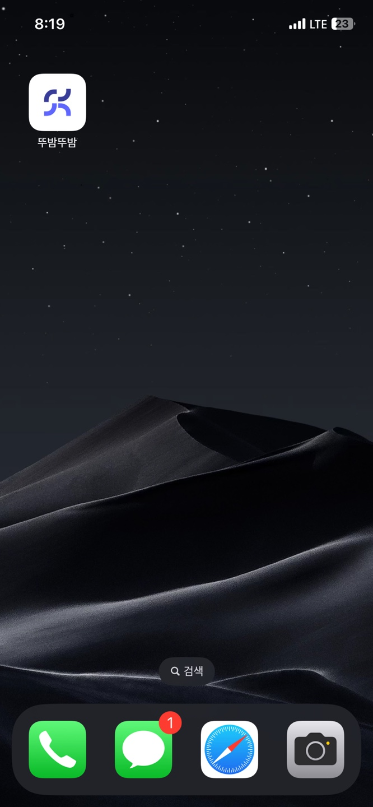
</p>

## 주요 기능 📦

### ⭐️ Kakao Maps SDK & Kakao REST API

- Kakao Rest API를 활용해 특정 장소를 검색한 뒤 위도 및 경도 데이터를 얻어 목적지까지 경로를 화면상 지도에 표시하였습니다.

### ⭐️ 공공데이터 포털 API 활용

- CCTV, 가로등 데이터를 활용하여 지도 상 마커로 표시하여 안전한 경로임을 시각화하였습니다.

### ⭐️ 현 위치 기반 / 인기 산책로 제공

- navigator.geolocation 객체를 사용해 사용자의 현 위치를 얻고, 현 위치 기반 인근 산책로를 제공합니다.
- 서울의 인기있는 산책로 리스트를 제공합니다.

### ⭐️ 리뷰 작성

- 완료한 산책로에 대해 리뷰를 남길 수 있습니다.

### ⭐️ PWA(Progressive Web Application)

- PWA를 활용하여 네이티브 앱처럼 동작 가능하게 하였습니다.
- 웹페이지에서 다운로드하여 모바일 앱처럼 활용이 가능합니다.

---

## 아키텍쳐

### 디렉토리 구조

```bash
├── README.md
├── package-lock.json
├── package.json
├── strapi-backend :
│   ├── README.md
│   ├── api : db model, api 관련 정보 폴더
│   │   ├── about
│   │   ├── course
│   │   └── lecture
│   ├── config : 서버, 데이터베이스 관련 정보 폴더
│   │   ├── database.js
│   │   ├── env : 배포 환경(NODE_ENV = production) 일 때 설정 정보 폴더
│   │   ├── functions : 프로젝트에서 실행되는 함수 관련 정보 폴더
│   │   └── server.js
│   ├── extensions
│   │   └── users-permissions : 권한 정보
│   ├── favicon.ico
│   ├── package-lock.json
│   ├── package.json
│   └── public
│       ├── robots.txt
│       └── uploads : 강의 별 사진
└── voluntain-app : 프론트엔드
    ├── README.md
    ├── components
    │   ├── CourseCard.js
    │   ├── Footer.js
    │   ├── LectureCards.js
    │   ├── MainBanner.js : 메인 페이지에 있는 남색 배너 컴포넌트, 커뮤니티 이름과 슬로건을 포함.
    │   ├── MainCard.js
    │   ├── MainCookieCard.js
    │   ├── NavigationBar.js : 네비게이션 바 컴포넌트, _app.js에서 공통으로 전체 페이지에 포함됨.
    │   ├── RecentLecture.js
    │   └── useWindowSize.js
    ├── config
    │   └── next.config.js
    ├── lib
    │   ├── context.js
    │   └── ga
    ├── next.config.js
    ├── package-lock.json
    ├── package.json
    ├── pages
    │   ├── _app.js
    │   ├── _document.js
    │   ├── about.js
    │   ├── course
    │   ├── index.js
    │   ├── lecture
    │   ├── newcourse
    │   ├── question.js
    │   └── setting.js
    ├── public
    │   ├── favicon.ico
    │   └── logo_about.png
    └── styles
        └── Home.module.css

```

<!--
```bash
├── README.md : 리드미 파일
│
├── strapi-backend/ : 백엔드
│   ├── api/ : db model, api 관련 정보 폴더
│   │   └── [table 이름] : database table 별로 분리되는 api 폴더 (table 구조, 해당 table 관련 api 정보 저장)
│   │       ├── Config/routes.json : api 설정 파일 (api request에 따른 handler 지정)
│   │       ├── Controllers/ [table 이름].js : api controller 커스텀 파일
│   │       ├── Models : db model 관련 정보 폴더
│   │       │   ├── [table 이름].js : (사용 X) api 커스텀 파일
│   │       │   └── [table 이름].settings.json : model 정보 파일 (field 정보)
│   │       └─── Services/ course.js : (사용 X) api 커스텀 파일
│   │
│   ├── config/ : 서버, 데이터베이스 관련 정보 폴더
│   │   ├── Env/production : 배포 환경(NODE_ENV = production) 일 때 설정 정보 폴더
│   │   │   └── database.js : production 환경에서 database 설정 파일
│   │   ├── Functions : 프로젝트에서 실행되는 함수 관련 정보 폴더
│   │   │   │   ├── responses : (사용 X) 커스텀한 응답 저장 폴더
│   │   │   │   ├── bootstrap.js : 어플리케이션 시작 시 실행되는 코드 파일
│   │   │   │   └── cron.js : (사용 X) cron task 관련 파일
│   │   ├── database.js : 기본 개발 환경(NODE_ENV = development)에서 database 설정 파일
│   │   └── server.js : 서버 설정 정보 파일
│   │ 
│   ├── extensions/
│   │   └── users-permissions/config/ : 권한 정보
│   │ 
│   └── public/
│       └── uploads/ : 강의 별 사진
│
└── voluntain-app/ : 프론트엔드
    ├── components/
    │   ├── NavigationBar.js : 네비게이션 바 컴포넌트, _app.js에서 공통으로 전체 페이지에 포함됨.
    │   ├── MainBanner.js : 메인 페이지에 있는 남색 배너 컴포넌트, 커뮤니티 이름과 슬로건을 포함.
    │   ├── RecentLecture.js : 사용자가 시청 정보(쿠키)에 따라, 현재/다음 강의를 나타내는 컴포넌트 [호출: MainCookieCard]
    │   ├── MainCookieCard.js : 상위 RecentLecture 컴포넌트에서 전달받은 props를 나타내는 레이아웃 컴포넌트.
    │   ├── MainCard.js : 현재 등록된 course 정보를 백엔드에서 받아서 카드로 나타내는 컴포넌트 [호출: CourseCard]
    │   └── CourseCard.js : 상위 MainCard 컴포넌트에서 전달받은 props를 나타내는 레이아웃 컴포넌트
    │
    ├── config/
    │   └── next.config.js
    │
    ├── lib/
    │   └── ga/
    │   │   └── index.js
    │   └── context.js
    │
    ├── pages/
    │   ├── courses/
    │   │   └── [id].js : 강의 페이지
    │   ├── _app.js : Next.js에서 전체 컴포넌트 구조를 결정, 공통 컴포넌트(navbar, footer)가 선언되도록 customizing 됨.
    │   ├── _document.js : Next.js에서 전체 html 문서의 구조를 결정, lang 속성과 meta tag가 customizing 됨.
    │   ├── about.js : 단체 소개 페이지
    │   ├── index.js : 메인 페이지
    │   ├── question.js : Q&A 페이지
    │   └── setting.js : 쿠키, 구글 애널리틱스 정보 수집 정책 페이지
    │
    ├── public/
    │   ├── favicon.ico : 네비게이션바 이미지
    │   └── logo_about.png : about 페이지 로고 이미지
    │
    └── styles/
        └── Home.module.css

```
-->
