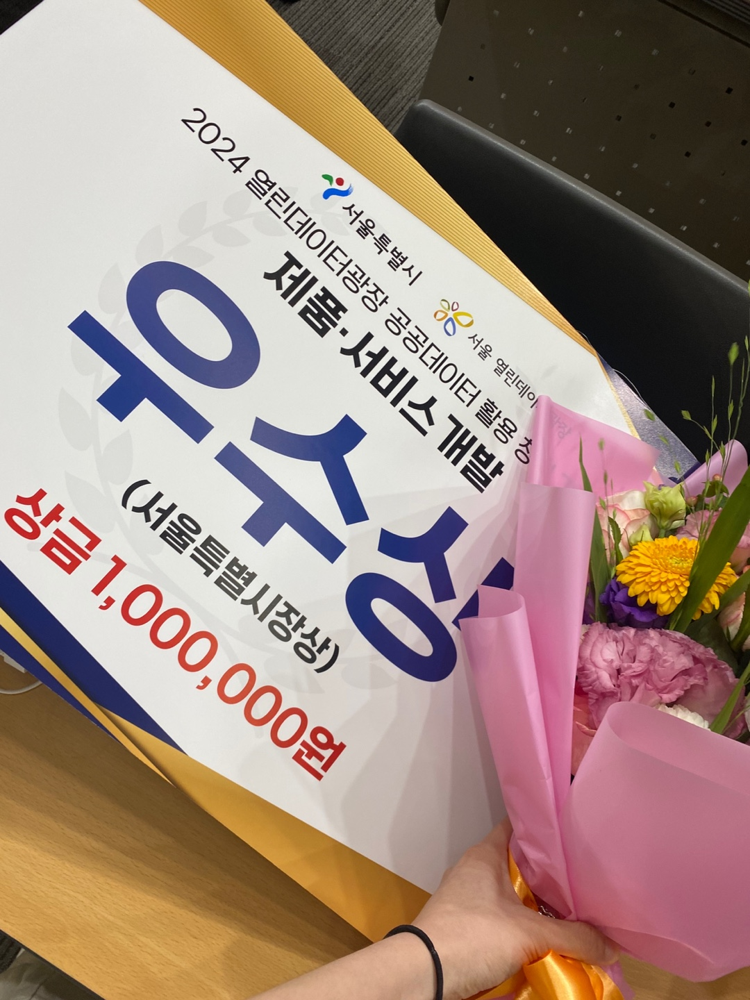

# 뚜벅뚜벅, 서울 어디든 안전하게 "뚜밤뚜밤"

# 뚜밤뚜밤

> **2024 열린데이터광장 공공데이터 활용 창업 경진대회 우수상 (223팀 중 3위)**   **개발기간: 2024.04 ~ 2024.06**

## 배포 주소

> **개발 버전** : [https://ddubam.site/](https://ddubam.site/)

## 팀 소개

|                                  최승빈                                   |                                   노우영                                   |                                   김수영                                   |                                    이재준                                     |                                    권지민                                     |
| :-----------------------------------------------------------------------: | :------------------------------------------------------------------------: | :------------------------------------------------------------------------: | :---------------------------------------------------------------------------: | :---------------------------------------------------------------------------: |
|  |  |  |  |  |
|                  [@csb9427](https://github.com/csb9427)                   |                  [@norunaru](https://github.com/norunaru)                  |                  [@sootudio](https://github.com/sootudio)                  |                [@jaejunlee11](https://github.com/jaejunlee11)                 |                                                                               |
|                              Team Leader, PM                              |                                  Frontend                                  |                                  Backend                                   |                                    Backend                                    |                                    Design                                     |

## 프로젝트 소개

뚜밤뚜밤은 서울시 관광지와 CCTV 공공데이터를 활용하여 안전하게 이동하고 서울을 둘러보는 서비스입니다.

### 배경

- 사회적 필요성: 2022년 사회조사 결과에 따르면, 13세 이상 인구 3명 중 1명은 야간 보행 시 불안함을 느끼고 있습니다.
- 불안감 통계: 한국보건사회연구원의 조사에 따르면, 한국은 범죄 피해경험률은 가장 낮지만, 범죄에 대한 불안감은 최상위권에 속합니다.

### 서비스 목적

서울시 관광지와 CCTV 공공데이터를 활용해:

- 안전한 이동 경로를 제공
- 주위 환경을 실시간으로 모니터링하여 안전성을 높임

이 서비스를 통해 서울 시민과 관광객들이 보다 안심하고 야간에도 자유롭게 이동할 수 있는 환경을 조성하고자 합니다.

## Stacks 🐈

### Environment

### Config

### Development

### Communication

## 디자인 시스템

## 화면 구성 📺

### 온보딩 페이지

  
  

### 홈 페이지

  
  

### 검색 페이지

  
  

### 길안내 페이지

  
  
  

### 산책로 정보 페이지, 코스 정보 페이지

  
  

### 마이페이지, 모바일 페이지

  
  

## 주요 기능 📦

### ⭐️ Kakao Maps SDK & Kakao REST API

- Kakao Rest API를 활용해 특정 장소를 검색한 뒤 위도 및 경도 데이터를 얻어 목적지까지 경로를 화면상 지도에 표시하였습니다.

### ⭐️ 공공데이터 포털 API 활용

- CCTV, 가로등 데이터를 활용하여 지도 상 마커로 표시하여 안전한 경로임을 시각화하였습니다.

### ⭐️ 현 위치 기반 / 인기 산책로 제공

- navigator.geolocation 객체를 사용해 사용자의 현 위치를 얻고, 현 위치 기반 인근 산책로를 제공합니다.
- 서울의 인기있는 산책로 리스트를 제공합니다.

### ⭐️ 리뷰 작성

- 완료한 산책로에 대해 리뷰를 남길 수 있습니다.

### ⭐️ PWA(Progressive Web Application)

- PWA를 활용하여 네이티브 앱처럼 동작 가능하게 하였습니다.
- 웹페이지에서 다운로드하여 모바일 앱처럼 활용이 가능합니다.

## 🚀 프론트엔드 개발 상세 설명

- Single Page Application을 채택해 자연스러운 사용자 인터페이스 흐름을 유지하고 사용자 경험을 향상시켰습니다.
- React 라이브러리를 사용하여 가독성이 높은 JSX문법을 사용해 개발의 복잡성을 줄이고, 컴포넌트 모듈화를 통해 효율적인 개발을 하였습니다.
- styled-components를 활용하여 디자이너의 컴포넌트 스타일을 적용하고, 가독성과 유지보수성을 높였습니다.
- JavaScript의 navigator.geolocation객체로 사용자의 위도, 경도 데이터를 저장하고, Kakao Map SDK와 함께 활용했습니다.
- 상태 관리 라이브러리 Recoil을 사용하여 React의 상태 관리를 유연하게 확장했습니다.
- HTTP 클라이언트 라이브러리인 Axios를 사용해 비동기 통신을 구현하고, API 호출을 통해 데이터를 가져왔습니다. Axios의 간편한 사용법과 다양한 기능 덕분에 서버와의 통신을 효율적으로 처리할 수 있었습니다.

## ✔️프로젝트 리뷰

- 5인으로 구성된 팀에서 프론트엔드 개발 역할을 맡아 디자이너, 백엔드, 기획자와 소통하였고, 팀의 목표를 달성하기 위해 협력하는 과정을 통해 많은 것을 배웠습니다.
- 기획자, 백엔드 개발자와의 소통을 통해 요구사항을 명확히 이해하고, 효율적인 데이터 연동을 완료할 수 있었습니다. 이를 통해 팀워크의 중요성과 협업 능력을 향상시킬 수 있었습니다. 또한, 프로젝트의 진행 순서를 이해하고 일정 조율의 중요성을 배우며, 효과적인 타임라인 관리와 우선순위 설정의 필요성을 깨달았습니다.
- 디자이너와의 협업을 통해 더 나은 UI/UX 제공 방법에 대한 이해도를 높일 수 있었습니다.
- 다양한 API들을 사용해 보면서 API 통합 및 데이터 처리에 대한 실질적인 경험을 쌓을 수 있었습니다.
- 프로젝트를 통해 새로운 기술을 학습하고, 이를 실제로 적용해보는 과정을 통해 개인적으로 많은 성장을 이룰 수 있었습니다. React, Recoil, Axios 등 다양한 프론트엔드 기술을 익히고, 실무에 적용하는 경험을 쌓았습니다.
